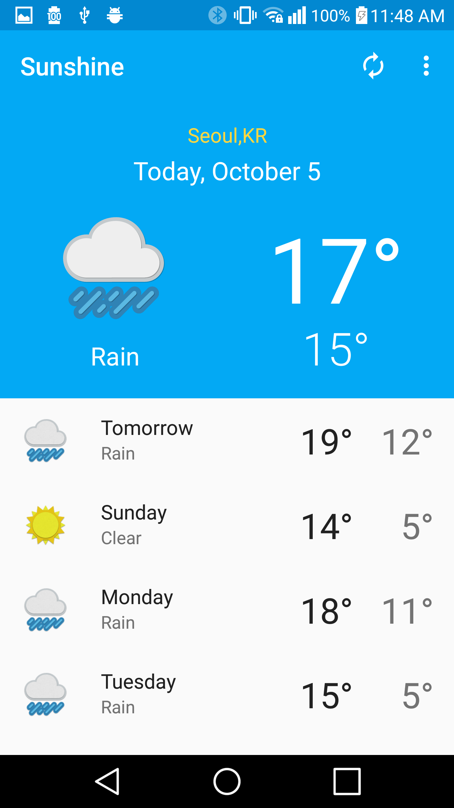
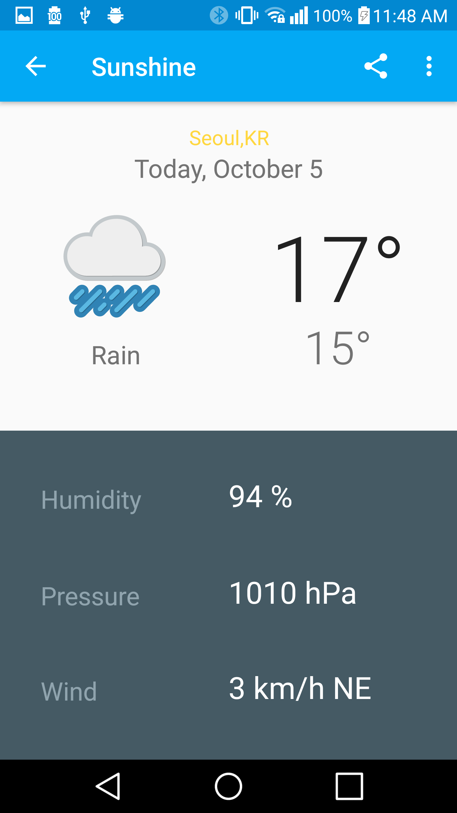
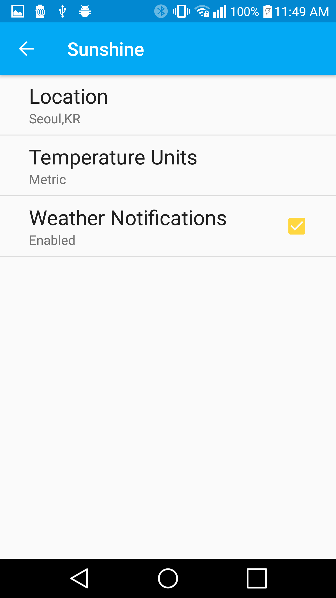
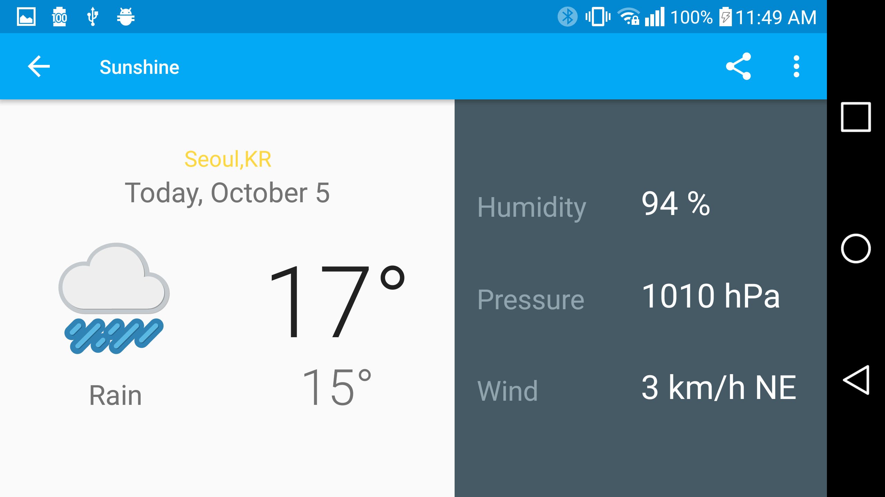

# MySunshine
This project is a replica of Sunshine weather app in Udacity Developing Android
Apps (ud851) course. The repo for the original project can be found in this
[link](https://github.com/udacity/ud851-Sunshine).

## Screenshots

  

## Goal
The main goal is to reflect the changes here without TODO guides to get better
grasp of the concepts that were taught during the course.
